# Restore + backfill walkthrough

Step-by-step visual guide for using **↻ Restore from JSON** and **🔗 Backfill pair IDs** on `working.html`. Red / teal overlays in the screenshots are pointers only — they are NOT in the shipped UI.

The coverage numbers you see in the screenshots (`0.0% → 100.0%`, `5 clashes updated`) come from a small synthetic fixture used to render this guide. Your own numbers will reflect the actual archive.

---

## Pre-flight: download `working.html` from GitHub

You only need to do this once per release.

1. Open the repo blob page for the file: <https://github.com/Aspiring-Design-3D-Consultancy-Ltd/nw-clash-platform/blob/main/working.html>
2. In the top-right of the file viewer, click the **Download raw file** icon (down-arrow to a horizontal line). GitHub also serves it directly at <https://raw.githubusercontent.com/Aspiring-Design-3D-Consultancy-Ltd/nw-clash-platform/main/working.html>.
3. Save it to the SharePoint-synced folder you use for coordination (or any local folder — the app runs entirely offline).
4. Open the saved file in Chrome or Edge. On Windows, right-click → Open with → Google Chrome (or Microsoft Edge). The URL bar will show `file:///.../working.html`.

The app opens on the auth screen. Enter your existing PIN (or set one on first launch). Everything from here on is the in-browser walkthrough.

---

## Step 1 — Dashboard on first open

`working.html` opens on the Dashboard. On first launch it seeds a demo dataset (104 clashes across four weeks in January) — that's what you're looking at here. If you've imported real data in a previous session, you'll see your own register.

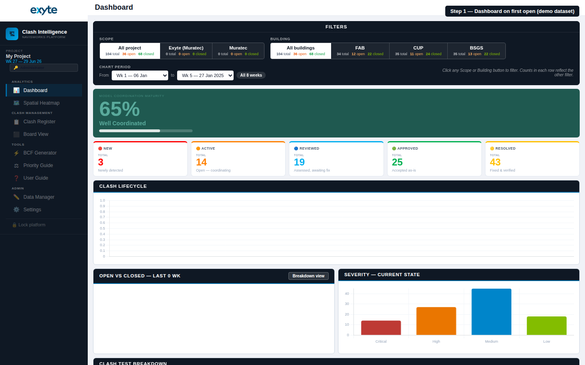

---

## Step 2 — Navigate to Settings

Click **Settings** in the sidebar (bottom of the ADMIN group). The Restore and Backfill actions live in the **Data Management** section, not on the Data Manager tab.

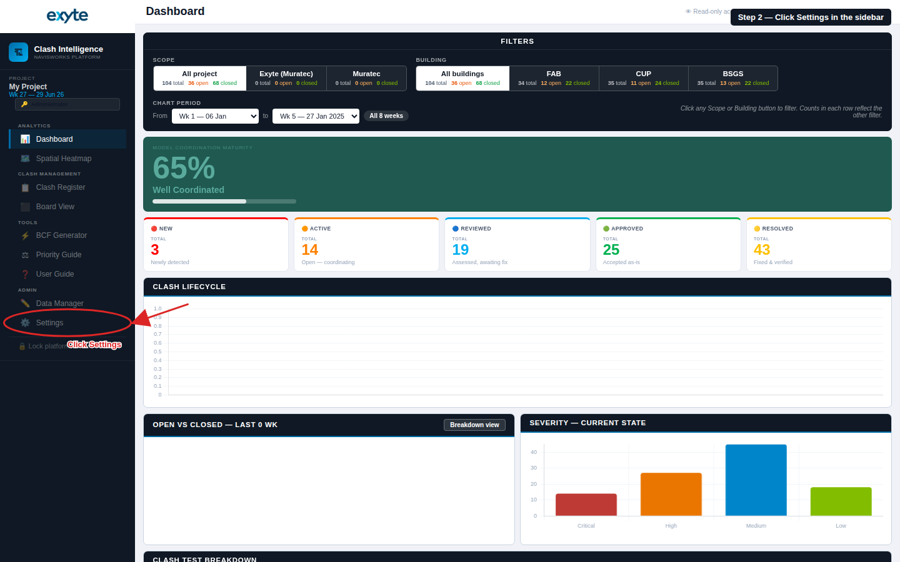

---

## Step 3 — Data Management row

Scroll to the **Data Management** section. Three related buttons live on this row (existing buttons like Export CSV, Backup JSON, Selective reset remain unchanged):

- **↻ Restore from JSON** (red circle) — full-state replace from a previously exported Backup JSON. Covered in Steps 4–7.
- **🔗 Backfill pair IDs** (teal circle) — retro-fit Element IDs onto existing register clashes by reparsing archived XMLs. Covered in Steps 8–12.
- **🎯 Selective reset** (grey circle) — unchanged; kept adjacent for reference.

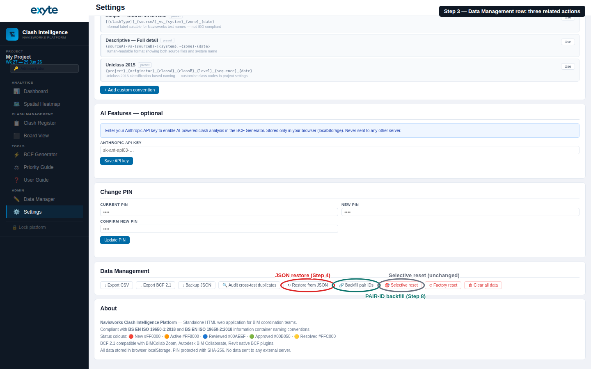

---

## Step 4 — Open the Restore modal

Click **↻ Restore from JSON**. The modal explains what will happen and asks you to type `REPLACE` to gate the destructive action. The **Replace state** button stays disabled until (a) a valid JSON is loaded AND (b) `REPLACE` is typed exactly (case sensitive).

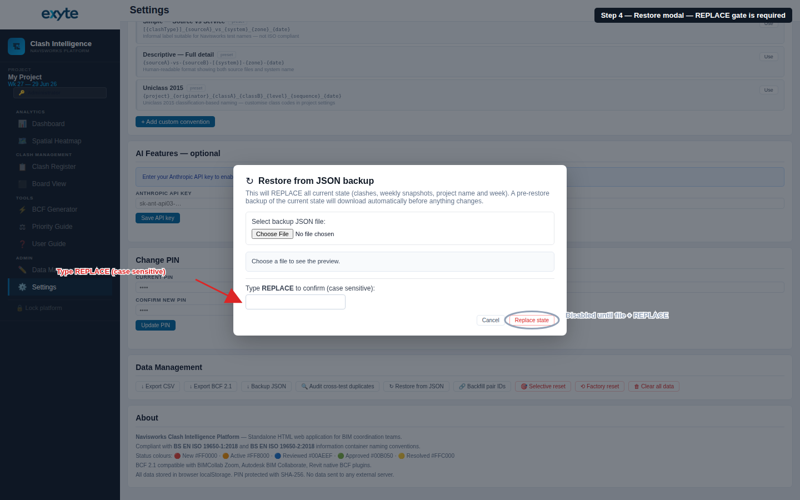

---

## Step 5 — Choose the backup file

Click **Choose File** and pick your `ClashPlatform_Backup_*.json`. The app parses it on selection and shows a preview: project name, clash count, distinct-test count, weekly snapshot count, and the exported timestamp. If the file is malformed or missing required fields (`clashes[]`, `weekly[]`, `projName`, plus `uid`/`testName`/`nwOrig`/`status` per clash), the preview turns red and the button stays disabled.

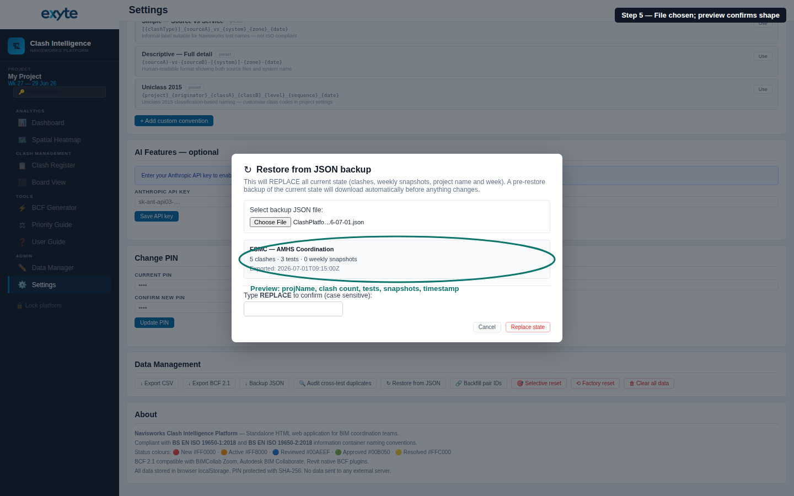

---

## Step 6 — Confirm

Type `REPLACE` in the confirmation input. The **Replace state** button unlocks. Click it to trigger the restore.

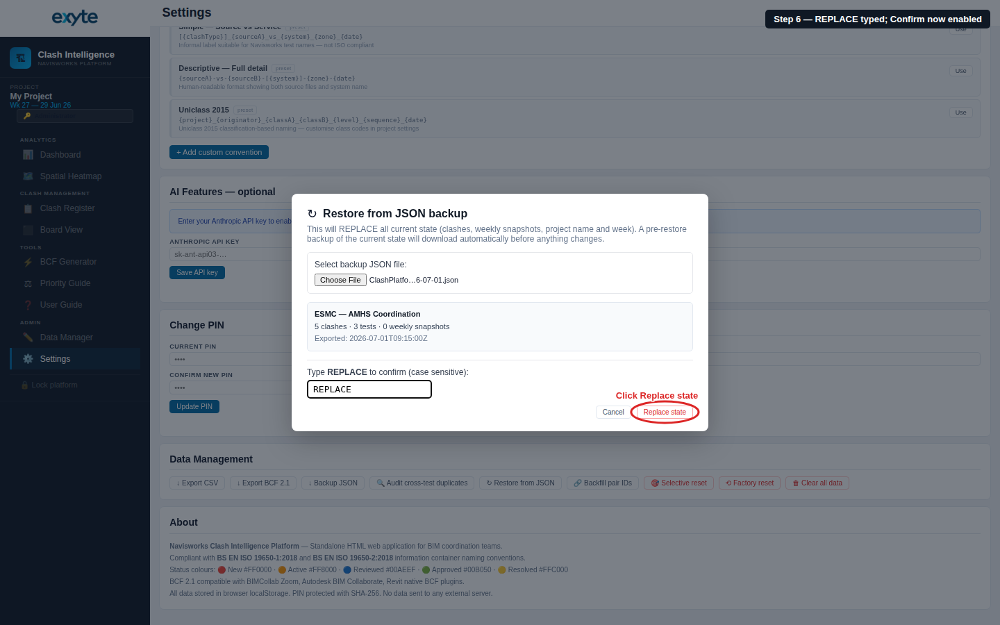

---

## Step 7 — Verify the restored dashboard

Two things happen the moment you click:

1. Your browser auto-downloads `pre-restore-<timestamp>.json` — this is a safety snapshot of the state that was about to be replaced. Keep it until you're satisfied with the restore.
2. The register is replaced, weekly snapshots are regenerated from it, the toast confirms the counts, and the Dashboard reflects the restored state (project name in the sidebar, clash counts on the strip, etc.).

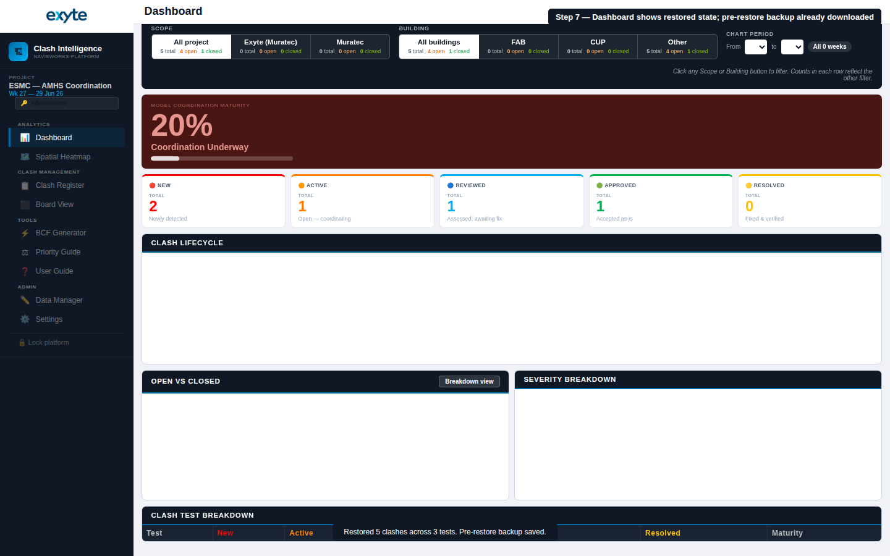

---

## Step 8 — Open the Backfill modal

Go back to **Settings → Data Management** and click **🔗 Backfill pair IDs**. The modal explains that this is a metadata-only operation: only `elementIdA`, `elementIdB`, `elementIdSrcA`, `elementIdSrcB`, `sourceA`, `sourceB` are touched. Status, notes, priority, assignedTo, statusHistory, coordinates and dates are **never** modified.

The **Apply backfill** button stays disabled until the dry-run report renders and at least one register clash is matched.

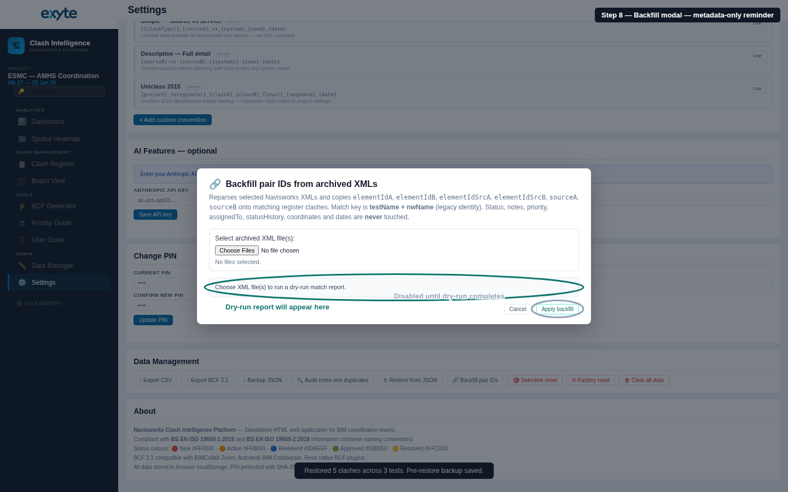

---

## Step 9 — Select the archived XMLs

Click **Choose Files** and multi-select every archived XML you want to use as a source. In the screenshot below, 13 files have been selected and the parser has extracted 26 clashes in total. The file input accepts the standard Ctrl-click / Shift-click multi-select — you can also pick every XML in a single folder at once.

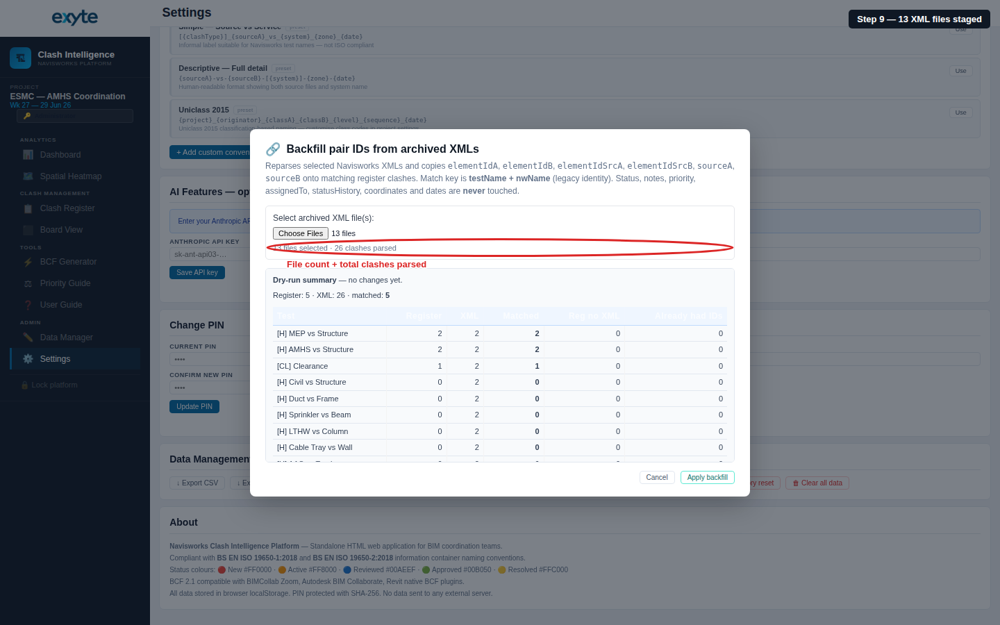

---

## Step 10 — Read the dry-run report

The moment the files finish parsing, the report renders per-test:

- **Register** — clashes in the current register for that test.
- **XML** — clashes the archive supplied for that test.
- **Matched** — how many register rows will receive backfilled IDs. This is the number you care about.
- **Reg no XML** — register clashes with no matching archive row. These stay on the LEGACY tier — that's the expected residue when Navisworks has renumbered a clash between the archive export and the register capture.
- **Already had IDs** — register clashes that already carry both `elementIdA` and `elementIdB`. Backfill overwrites these anyway, but the count is surfaced so you know how much is genuinely NEW versus refreshed.

Nothing has changed on disk yet.

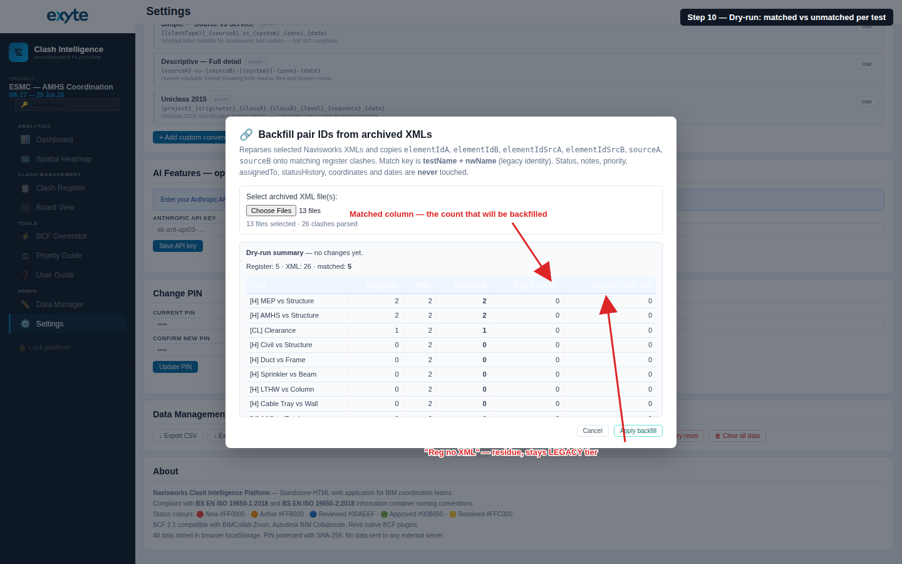

---

## Step 11 — Apply

If the numbers look right, click **Apply backfill**. If they don't (for example, Matched is unexpectedly low), close the modal, reselect a different XML set, and re-run the dry-run.

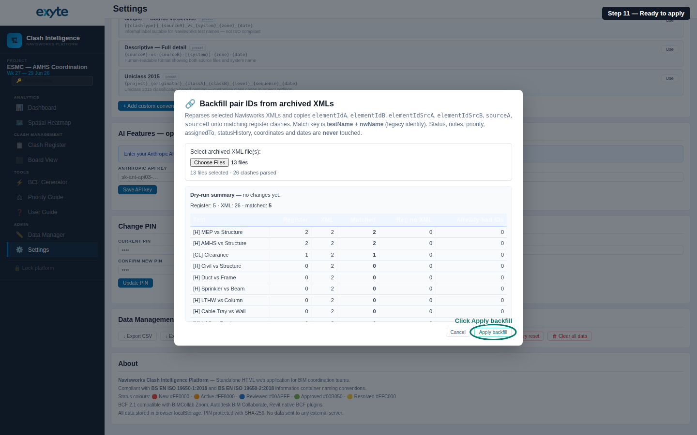

---

## Step 12 — Success card

On apply, the browser auto-downloads `pre-backfill-<timestamp>.json` (safety snapshot) and the register updates in place. The success card replaces the dry-run table with the coverage delta:

- **Side A / B ID coverage** — the headline metric. `0% → 100%` means every register clash now has an identity attribute captured on both sides.
- **pairKey ID tier** — count of register clashes that will now match by ID on future imports (stable across Navisworks renumbering).
- **pairKey COMP tier** — clashes that resolve via source + element name composite. Second-line defence.
- **pairKey LEGACY tier** — clashes still on the fragile testName+nwOrig fallback. Anything left here is either from an XML with no identity attribute at all (Exyte AAS residue) or was never matched in the dry-run.

The toast at the bottom confirms the count and new coverage percentages. The **Applied** button and the closing note about `pre-backfill-*.json` are the last things you need to see before closing the modal.

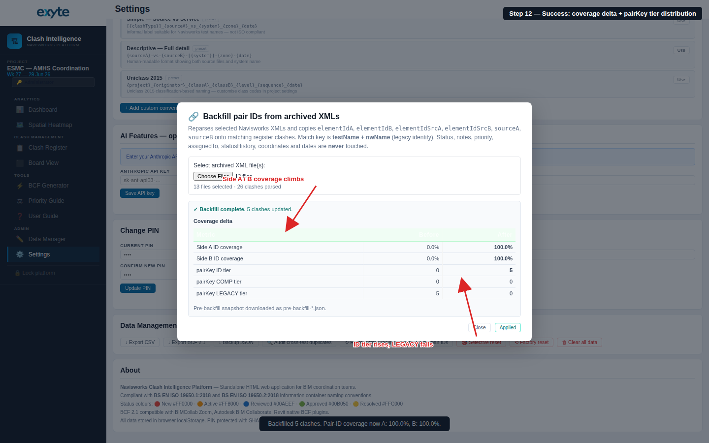

---

## Troubleshooting

- **Preview says "Invalid backup"** — the file is missing a top-level field (`clashes[]`, `weekly[]`, `projName`) or one of its clash records lacks `uid` / `testName` / `nwOrig` / `status`. Open the JSON in a text editor and inspect the first few clash records.
- **Dry-run Matched column is 0** — the register's `testName` values don't match any `<clashtest name="...">` in the XML, or `nwOrig` doesn't match any `<clashresult name="...">`. This is expected if the archive is from a different project or a different day's export than the register was built from.
- **Apply didn't seem to change anything** — refresh the Dashboard tab; the sidebar and strip counts update on nav. Also check that the pre-backfill snapshot downloaded — if it didn't, your browser may have blocked automatic downloads for `file://` origins.
- **Rolling back** — the pre-restore / pre-backfill JSON that auto-downloaded is a full-state snapshot. Restore it via **↻ Restore from JSON** to undo the operation exactly.

---

Related PRs:
- [#2 — BGATR-ID-MULTI + PAIR-ID-COMPOSITE-FALLBACK](https://github.com/Aspiring-Design-3D-Consultancy-Ltd/nw-clash-platform/pull/2) — the parser fix that made the composite pair key possible.
- [#3 — JSON-BACKUP-RESTORE + PAIR-ID-BACKFILL](https://github.com/Aspiring-Design-3D-Consultancy-Ltd/nw-clash-platform/pull/3) — the two features documented above.
